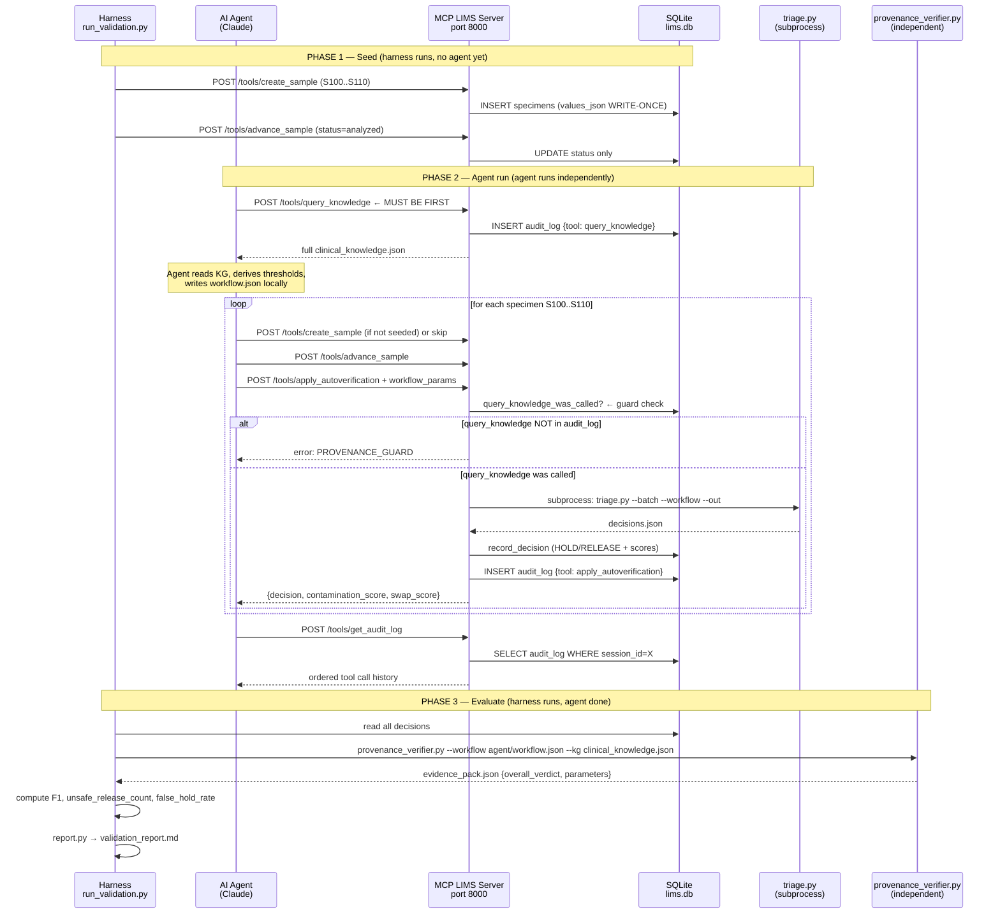

# Claude Code — Read This First

**Required reading before starting ANY task — in this order:**
1. This file (`CONTEXT.md`) — repo orientation, starting point, sequence diagram
2. `IMPL_SPEC.md` — task registry, global constraints, pass criteria
3. `docs_main/LIS_MCP_DEMO_DESIGN_v2.md` — what this builds and why (consulting narrative, agent workflow, report format, component roles)
4. `docs_main/system_architecture.md` — system diagram, process boundaries, negative guardrails
5. Your assigned spec file (`spec/NN_*.md`) — the specific task to implement

**Do not skip steps 3 and 4.** The spec files tell you *how* to build each component. The design doc and architecture doc tell you *what* the system does and *what you must never do*. Without both, you will make incorrect assumptions about component boundaries and data flow.

---

## Starting Point — Tom Sheffler's MCP LIMS Server

**Reference repo:** https://github.com/sheffler/mcp-server-lims  
**Article:** https://www.linkedin.com/pulse/ai-agent-lims-iot-mcp-tom-sheffler-ylmpc/

This is the foundation for `demo/server/lims_server.py`. Read his `lims_server.py`
before implementing Task 02. Understand his tool definition pattern and SQLite usage.

**Key differences — what we change from his implementation:**

| His implementation | Our implementation |
|---|---|
| stdio transport (Claude Desktop config) | HTTP/SSE transport (FastAPI + uvicorn, port 8000) |
| Uses separate `mcp-server-sqlite` process | Integrated SQLite via `lims_db.py` (Task 01) |
| Tools: `preparation_tool`, analyzer | Tools: `create_sample`, `advance_sample`, `apply_autoverification`, `get_audit_log`, `query_knowledge` |
| No audit log | Append-only audit log — CAP documentation |
| No knowledge graph | `query_knowledge` exposes clinical_knowledge.json |
| No provenance guard | `apply_autoverification` blocked if `query_knowledge` not called first |
| Prompt describes 4 steps, only preparation implemented | All 5 tools fully implemented |
| No validation harness | Full two-layer harness (Layer 1: F1, Layer 2: provenance) |

**His prompt gap (important context):** Tom's demo prompt describes accessioning,
preparation, analysis, and report generation — but his MCP server only implements
the preparation tool. The agent must fill the gaps with inference. Our implementation
has no such gaps — every tool the agent needs is explicitly implemented.

**Do NOT use his stdio configuration.** His `claude_desktop_config.json` pattern
(`command` + `args`) is stdio. We use HTTP/SSE. See `spec/02_lims_server.md`.

---

## Repo Orientation

```
LISAgentValidation/
  IMPL_SPEC.md                    ← master task index + global constraints
  CONTEXT.md                      ← this file
  spec/                           ← one file per build task
  docs_main/
    system_architecture.md        ← Mermaid diagram + negative guardrails
    LIS_MCP_DEMO_DESIGN_v2.md     ← architecture narrative (why, not how)
  lis-swap-contamination-triage/  ← EXISTING CODE — read-only
    environment/
      src/triage.py               ← deterministic scorer — DO NOT MODIFY
      data/clinical_knowledge.json← knowledge graph — DO NOT MODIFY
      data/visible_batch_nolabels.json
      data/visible_batch.json
  demo/                           ← ALL NEW CODE GOES HERE (create this)
```

---

## Existing Files to Read Before Building

**Before Task 02 (`lims_server.py`) — read these to verify call interfaces:**
```bash
# Understand triage.py CLI and what batch.json/workflow.json must contain
head -80 lis-swap-contamination-triage/environment/src/triage.py

# Understand the workflow.json parameters triage.py reads
grep -n "workflow\|threshold\|contamination\|swap" \
  lis-swap-contamination-triage/environment/src/triage.py | head -40
```

**Before Task 04 (`provenance_verifier.py`) — read these to verify KG node paths:**
```bash
# See exact node names and field names in the knowledge graph
cat lis-swap-contamination-triage/environment/data/clinical_knowledge.json
```

**Before Task 06 (`run_validation.py`) — Tasks 01–05 must be DONE and VERIFIED.**

---

## Agent Run Sequence (critical for audit order constraint)



---

## Key Invariants (verify these hold in your implementation)

1. `values_json` written once in Phase 1. Never touched again.
2. `query_knowledge` appears in `audit_log` before any `apply_autoverification` entry — enforced by server guard.
3. `provenance_verifier.py` runs in Phase 3, never during Phase 2. It reads files only.
4. `expected_outcomes.csv` is never read by the server. Harness-only.
5. `triage.py` is called as subprocess, not imported. One call per `apply_autoverification`.
6. Session ID is consistent across all Phase 2 calls from the agent. Harness uses same session ID in Phase 3 to retrieve the right audit log.

---

## How to Run Each Phase

```bash
# Start server (leave running for Phase 2)
cd demo
uvicorn server.lims_server:app --host 0.0.0.0 --port 8000

# Phase 1 — seed
python3 harness/run_validation.py --phase seed --session-id run-001

# Phase 2 — give agent:
#   - agent/task_prompt_filled.md  (generated by seed phase)
#   - server URL: http://localhost:8000
#   - session ID: run-001
#   Agent writes: agent/workflow.json

# Phase 3 — evaluate
python3 harness/run_validation.py --phase evaluate \
  --session-id run-001 \
  --workflow agent/workflow.json \
  --out validation_report.md
```
