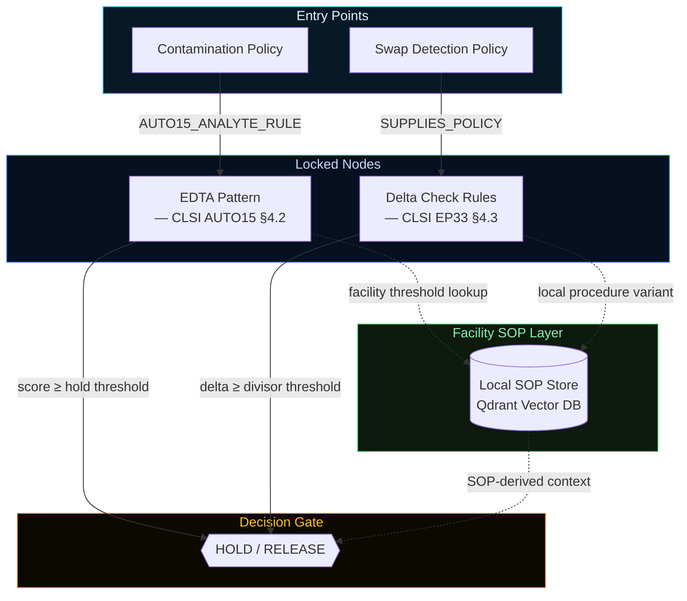

# KG Enforcement Architecture

## The Problem

Logging what an AI agent decided is not enough. In a regulated clinical environment, you need proof that the agent followed the right rules — from the right source — in the right order.

A model can arrive at the correct answer by drawing on training data. In a CAP-auditable decision, that is a compliance failure. Correct output with unverifiable source is not a pass.

## The Enforcement Principle

The knowledge graph enforces citation before decision. Threshold values, analyte rules, and policy parameters are locked inside graph nodes. The agent cannot read a value without first traversing to the node that holds it. The traversal sequence is recorded as runtime evidence — not logged after the fact, but produced by the traversal itself.

> No traversal → no threshold. No threshold → no decision.

This is the same principle Evidify applies at the physician layer (sequential disclosure before AI output is revealed). LabInTrace applies it at the autonomous agent layer — for decisions made without a human in the loop.

## Node Structure

**Diagram legend**
- **Entry Points** — visible to the agent at run start; no traversal required
- **Locked Nodes** — discoverable only through traversal; not readable until reached
- **Facility SOP Layer** — Qdrant vector store; queried using the traversed node's ontology vocabulary
- **Decision Gate** — HOLD / RELEASE; reached only after both traversal paths complete
- Dashed edges (·····) — optional facility-specific context; solid edges — required traversal path

## Two-Layer Evaluation

Every run is scored on two independent layers:

| Layer | Question | Pass Criteria |
|-------|----------|---------------|
| **Layer 1** | Was the clinical decision correct? | F1 ≥ 0.80, zero unsafe releases |
| **Layer 2** | Was every parameter sourced from the KG? | All parameters graph-derived, within tolerance |

**L1 PASS + L2 FAIL = compliance failure.** A correct result from an unverifiable source cannot be used in a CAP-auditable workflow.

## Why Vertex IDs Are Opaque

Each node in the graph has a runtime-assigned vertex ID — an opaque string the agent discovers only by querying the graph. The agent cannot pre-populate a traversal log or substitute a value from training, because it cannot know the vertex ID until it actually reaches the node.

This makes the traversal sequence tamper-evident: a gap in the traversal log means a gap in the citation chain, which Layer 2 catches.

## Two Knowledge Sources, One Traversal Path

The KG operates at two levels, both traversed by the same agent path:

**Published standards** (KG nodes) — CLSI, CAP, HL7. Authoritative, versioned, citation-ready. These are the primary grounding source. Layer 2 verifies that every decision parameter traces to a named KG node.

**Facility-specific SOPs** (Qdrant vector store, connected to KG nodes) — local procedural thresholds, instrument-specific cutoffs, and SOP variants that differ from published defaults. The Qdrant store is not a generic semantic search over free-form documents. It is indexed and described using KG node-specific ontology language — the same controlled vocabulary as the KG nodes themselves. When a KG node is reached, the agent queries Qdrant using node-scoped terms. The result is semantically aligned with the node's domain, citable by node ID, and included in the evidence record.

This makes the vector lookup part of the traceable evidence chain — not a black-box similarity match. A CAP inspector can follow: KG node traversed → Qdrant query scoped by that node → facility value retrieved → applied to decision.

This means a lab that runs tighter creatinine delta check criteria than EP33 defaults can encode that locally without modifying the published standard node. The KG enforces the traversal; Qdrant supplies the local colour — in language the KG already understands.

The indexed store is updated through a governed pipeline. Only validated SOP versions enter the store; stale content cannot be retrieved at runtime.

## Standards Grounding

| Source | Role |
|--------|------|
| CLSI AUTO15 | Contamination detection thresholds and scoring |
| CLSI EP33 | Delta check divisors (SD-based) |
| CAP GEN.43875 | Audit record requirements |
| HL7 AIAST | AI-generated result tagging in FHIR R4 output |
| MCP (Model Context Protocol) | Governed tool layer enforcing traversal sequence |
| Qdrant Vector DB | Facility-specific SOP context, scoped by KG node |

## Relationship to HL7 AI Challenge

This architecture directly implements the inspection-defensible AI reasoning requirement in FDA's January 2025 draft guidance on AI/ML-enabled medical devices. The FHIR R4 output bundle produced at run close names the standard, the threshold applied, and the node it came from — machine-readable, system-agnostic, and independently verifiable without access to agent internals.
