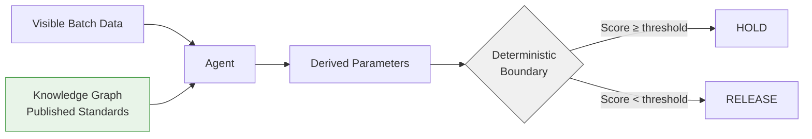

# Knowledge-Grounded Evaluation: A Pattern for Clinical AI Benchmarks

**Authors:** Alex Openstone  
**Date:** 2026-02-21  
**Status:** Pattern validated on LIS specimen triage benchmark  

---

## The Problem

Standard AI benchmarks have a structural flaw: agents can pass by fitting visible test data rather than applying domain knowledge.

In trajectory analysis of a clinical laboratory triage benchmark, GPT-5 passed by setting threshold parameters to within 0.05 units of visible specimen values — not by applying published CLSI delta check standards. The solution was formally incorrect by any clinical audit standard, yet it produced the right decisions on that specific batch. Pass/fail metrics cannot distinguish between an agent that learned the standard and one that learned your test set.

This is not a model limitation. It is a benchmark design problem.

---

## What This Is Not

Before describing the pattern, it is worth being precise about what it is not.

- **Not retrieval-augmented generation (RAG).** RAG uses retrieved context to answer questions. This pattern uses a knowledge graph to constrain the *structural boundary* of an evaluation task — the agent derives parameters from the graph, not answers.
- **Not scoring-side knowledge evaluation.** Prior work has used causal graphs to evaluate outputs after the fact. Here, the graph is on the task construction side — it determines what the correct solution *is*, not how to score what the agent produced.
- **Not prompt engineering.** Adding domain knowledge to an instruction prompt is prompt engineering. This pattern removes threshold values from instructions entirely and requires the agent to derive them from the graph.
- **A task-side structural constraint.** The knowledge graph sets the boundary condition. The agent must satisfy it. The margin between satisfying and not satisfying it is set by domain science, not by task design.

---

## The Pattern

**Knowledge graphs prevent data-fitting.** The task ships a static causal knowledge graph encoding authoritative domain standards. The agent must traverse the graph to derive parameters. An agent that reads the graph cannot short-circuit by fitting visible data — the graph is independent of the batch.

**Thresholds come from standards, not from the task designer.** Every node in the graph traces to a published source: CLSI EP33, KDIGO guidelines, peer-reviewed validation literature. The agent derives K_delta_min=3.0 because CLSI EP33 says so, not because the visible CKD patient happened to have K=6.10.

**The margin is set by biology, not test data.** With data-fitting, the margin between the threshold and the nearest confounding specimen is whatever the task designer chose. With a knowledge-graph-derived threshold, the margin is the clinical distance between stable CKD variation and acute EDTA contamination — established by decades of laboratory medicine research, not by this batch.

**Static JSON in benchmarks.** For self-contained evaluation tasks, the knowledge graph ships as a versioned JSON file inside the container. The agent reads it; the oracle derives all parameters from it. Task metadata records the graph version. Reproducibility is guaranteed across model updates and benchmark revisions.

**MCP server in production.** In a production deployment, the same knowledge graph is served by a persistent query service. Agents query it by concept. When CLSI updates a guideline, the service updates once and every connected agent receives the new threshold automatically. This direction is under active development — see Section 5.

---

## The Structural Margin Principle

> **In a properly grounded benchmark, the distance between correct and incorrect decisions is determined by domain science — not by proximity to test data.**

In traditional benchmarks, the margin between a correct threshold and the nearest confounding specimen is whatever the task designer chose when constructing test data. That margin can be closed by a fitting agent.

In knowledge-grounded evaluation, that margin is the clinical distance between the phenomenon being detected and the nearest legitimate confound — a distance established by the underlying biology and encoded in published standards. The benchmark designer does not control that margin. The biology does.

This separation has a concrete consequence: a fitting agent that adjusts its threshold by 1 SD in the wrong direction will fail the hidden batch. A graph-traversing agent that derives its threshold from CLSI EP33 will not — because the standard's margin is structural, not coincidental.

This pattern separates benchmark correctness from dataset proximity and enables versioned, standards-traceable evaluation in regulated environments.

---

## Why This Matters Now

Clinical AI is entering regulated deployment at the same time that evaluation methodology has not kept pace.

**CAP audit pressure.** CAP GEN.43875 requires that autoverification systems be validated "based on changes made." But if an AI agent passes validation by pattern-matching on a local dataset rather than applying the delta check standard, it is not validated against the standard — it is validated against that dataset. A different patient population produces a different result. CAP inspectors increasingly ask: *how do you know the AI is applying the correct standard, and not just your dataset?*

**Increasing agent deployment.** As agents replace rule-based autoverification logic, the implicit validation contract — "same input, same output, auditable rule" — breaks down. The agent's reasoning is not auditable in the same way. What remains auditable is whether the decision boundary was derived from a published standard. Knowledge-grounded evaluation makes that derivation explicit and testable.

**Regulatory explainability demands.** FDA guidance on clinical decision support software increasingly requires traceability from system outputs back to the clinical evidence base. A knowledge graph with source citations on every threshold node is a machine-readable audit trail. That trail does not exist in a model weight.

---

## Broader Applicability

This pattern applies to any domain where published authoritative standards govern correct parameter choices and agents can pass by fitting test data instead of applying them.

| Domain | Standards body | Example task |
|---|---|---|
| Clinical lab (this work) | CLSI, KDIGO | Delta check threshold configuration |
| Radiology AI | ACR, RSNA | Image quality threshold configuration |
| Drug dosing | FDA, ASHP | Dosing algorithm calibration |
| Financial compliance | SEC, FINRA, Basel | Risk model parameter configuration |
| Safety-critical software | IEC 62443, DO-178C | Safety margin configuration |

---

## Future Work: From Static Graph to Live Knowledge Agent

The static JSON graph is the foundation. The natural extension is a live, queryable knowledge service — the same graph served persistently, with updates propagating automatically as standards are revised.

Recent work in automated conversion of scientific documentation to queryable agent interfaces — including BioinfoMCP (arXiv 2510.02139), which demonstrates automated conversion of tool documentation to standardized agent interfaces at high success rates — points toward the infrastructure needed for clinical standards. The clinical variant would ingest CLSI PDFs and produce threshold query endpoints rather than execution endpoints.

This direction is under active development. The static graph pattern documented here is designed to be forward-compatible: the `graph_version` field and source citations on every node are design choices that make migration to a live service straightforward.

---

## References

1. Graph2Eval: Towards Evaluation of LLMs as Agents using Knowledge Graphs. arXiv:2510.00507, Oct 2025. [Link](https://arxiv.org/abs/2510.00507)
2. PRISM-Physics: Process-Driven Evaluation with DAG-structured Solutions. arXiv:2510.03185, Oct 2025. [Link](https://arxiv.org/abs/2510.03185)
3. AMG-RAG: Agentic Medical Graph-RAG. EMNLP 2025 Findings. [Link](https://aclanthology.org/2025.findings-emnlp.679/)
4. LAB-KG: Clinical laboratory knowledge graph for LLM-assisted interpretation. COLING 2025.
5. BioinfoMCP: A Unified Platform Enabling MCP Interfaces in Agentic Bioinformatics. Widjaja et al., arXiv:2510.02139, Oct 2025. [Link](https://arxiv.org/abs/2510.02139) *(see Future Work section)*
6. CLSI EP33: Protocols for the Validation of Equivalent Methods. Clinical and Laboratory Standards Institute.
7. Cornes MP, et al. "Spurious results due to EDTA contamination: an underappreciated problem?" Ann Clin Biochem. 2008.
8. KDIGO 2020 Clinical Practice Guideline for Diabetes Management in Chronic Kidney Disease.
